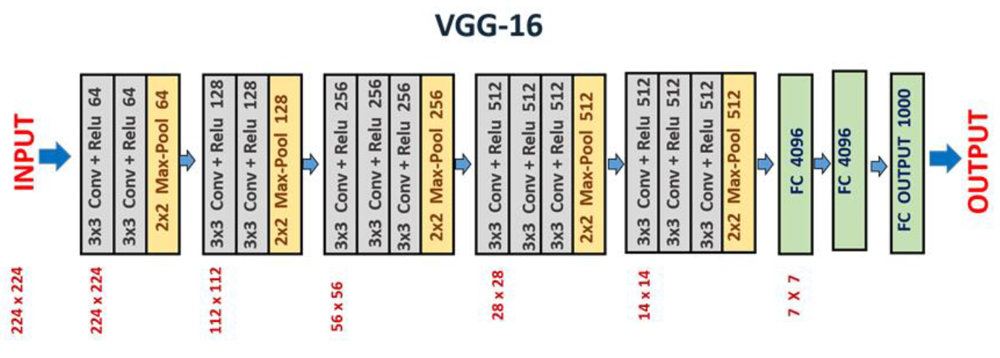

# Tutorial: PyTorch MLP CNN (VSCODE)

This is a template code for a general deep learning model project using VS Code in local PC.

You can reuse this tutorial code for your assignments.

## Preparation

1. Create the working directory: such as **`tutorial\TU_PyTorch_MLP_CNN_MNIST\`**
2. Download the Tutorial Code in Zip file:[ TU\_PyTorch\_MLP\_CNN\_MNIST.zip](https://github.com/ykkimhgu/DLIP-src/blob/main/Tutorial_Pytorch/TU_PyTorch_VSC/TU_PyTorch_MLP_CNN_MNIST.zip)
3. Unzip the files in the working directory.

***

## Example 1 : MLP

Classify the MNIST digit with a simple MLP

### Dataset

In this tutorial, we will use the MLP dataset saved in your local computer.

It is stores in `\data\` folder

### Model: Creating Architecture

We will create a class for the model architecture

The **Model Architecture** is programmed in the source code of: `mlp.py`

<figure><figcaption></figcaption></figure>

* Image Input: 1x28x28 image
* Flatten into a 1x28\*28 element vector
* 1st Layer: linear to 250 dimensions / ReLU
* 2nd Layer: linear to 100 dimensions / ReLU
* 3rd Layer: linear to 10 dimensions / log SoftMax
* Output: 1x10
* Activation function: ReLU

### Util: Train and Evaluation Modules

The modules for Training and Testing are defined in `train.py`, `eval.py`

> You don't need to modify these scripts.



```py
##########################################################
# Image Processing with Deep Learning in Handong Global University
# 
# Author        : Y.K.Kim
# Created       : 2026-05-07
# Language      : PyTorch
#   
# Decription    : [PyTorch Tutorial] This example is creating and training a MLP model for classification
# Model: MLP
##########################################################

import torch.nn as nn
import torch.nn.functional as F

##########################################################
##  Model Architecture   
##########################################################

# Model Architecture: MLP
class MLP(nn.Module):
    def __init__(self):
        super(MLP, self).__init__()
        self.flatten = nn.Flatten()
        self.linear1 = nn.Linear(28*28, 250)
        self.linear2 = nn.Linear(250, 100)
        self.linear3 = nn.Linear(100, 10)

        
    def forward(self, x):
        x=self.flatten(x)
        x= F.relu(self.linear1(x))
        x = F.relu(self.linear2(x))
        y_pred = F.log_softmax(self.linear3(x), dim=1)
        return y_pred
```



```py
# Train Module
def train(dataloader, model, loss_fn, optimizer, device, print_interval=100):
    # Dataset Size
    size = len(dataloader.dataset)

    # Batch size
    batch_size = dataloader.batch_size
    print(f"batch size : {batch_size}")

    # Model in Training Mode
    model.train()

    running_loss = 0.0

    for iter, (X, y) in enumerate(dataloader):
        X, y = X.to(device), y.to(device)

        # zero gradients for every batch
        optimizer.zero_grad()

        # Compute prediction loss
        pred = model(X)
        loss = loss_fn(pred, y)

        # Backpropagation and Update
        loss.backward()
        optimizer.step()

        # Print avg. loss for every mini-batch in an epoch
        running_loss += loss.item()
        if iter % print_interval == 0:
            running_loss = running_loss / print_interval
            current = iter * batch_size
            print(f"loss: {running_loss:>7f}  [{current:>5d}/{size:>5d}]")
            running_loss = 0
```



```py
import torch

# Evaluate Module
def evaluate(dataloader, model, device):
    model.eval()
    total_samples = len(dataloader.dataset)
    correct = 0

    with torch.no_grad():
        for images, labels in dataloader:
            images = images.to(device)
            labels = labels.to(device)

            outputs = model(images)
            predicted = outputs.argmax(dim=1)
            correct += (predicted == labels).sum().item()

    accuracy = correct / total_samples
    print(f"Test Accuracy: {accuracy * 100:.2f}%")
    return accuracy
```



### Main Script: Train and Evaluate

We will create a main script that runs the training and evaluating the model architecture.

> You can create different scripts for traing and testing.

The main script: **TU\_PyTorch\_MLP\_CNN\_main.py**

* Run this code and observe the loss
* Change the training epoch
* Run this code and observe the evaluation accuracy and sample images
* Understand each lines of code


```python
##########################################################
# Image Processing with Deep Learning in Handong Global University
# 
# Author        : Y.K.Kim
# Created       : 2026-05-07
# Language      : PyTorch
#   
# Decription    : [PyTorch Tutorial] This example is creating and training a MLP model for classification
##########################################################

import os
import torch
import torch.nn as nn
import torchvision.transforms as transforms
import matplotlib.pyplot as plt
from torch.utils.data import DataLoader
from torchvision import datasets

from models import MLP
from utils.train import train as training
from utils.eval import evaluate


# === Parameter === #
DATA_DIR_PATH = "data"
MODEL_DIR_PATH = "models"
MODEL_FILENAME = "MLP_MNIST_model.pth"

BATCH_SIZE = 64
TOTAL_EPOCHS = 2
LEARNING_RATE = 1e-3


##########################################################
## Part 0:  GPU setting
##########################################################

# Select GPU or CPU for training.
device = torch.device("cuda" if torch.cuda.is_available() else "cpu")
print(f"Using {device} device")


##########################################################
## Part 1:  Prepare Dataset 
##########################################################

# Download Dataset from TorchVision MNIST
# Once, downloaded locally, it does not download again.
#
#  MNIST shape:  1x28x28 

# transformation to tensor:  converts 0~255 value to 0~1 value.
data_transform = transforms.Compose([
    transforms.ToTensor()
    ])

# TRAIN DATA
training_data = datasets.MNIST(
    root=DATA_DIR_PATH,
    train=True,
    download=True,
    transform=data_transform,
    # transforms=ToTensor(),
    )

# EVAL DATA
test_data = datasets.MNIST(
    root=DATA_DIR_PATH,
    train=False,
    download=True,
    transform=data_transform,
    )

# Create DataLoader with Batch size N
# Input Dim:  [N, C, H, W]
train_dataloader = DataLoader(
    training_data, 
    batch_size=BATCH_SIZE, 
    shuffle=True,
    )

test_dataloader = DataLoader(
    test_data,
    batch_size=BATCH_SIZE,
    shuffle=False,
    )

for X, y in train_dataloader:
    print(f"Shape of X [N, C, H, W]: {X.shape}")
    print(f"Shape of y: {y.shape} {y.dtype}")
    break


##########################################################
## Part 2:  Create Model Instance 
##########################################################

# Model Class Construction
model = MLP().to(device)
print(model)


##########################################################
## Part 3:  Train Model
##########################################################

# Loss Function
loss_fn = nn.CrossEntropyLoss()

# Optimizer
optimizer = torch.optim.SGD(model.parameters(), lr=LEARNING_RATE)

def train():
    # Run Train for k epoch
    for epoch in range(TOTAL_EPOCHS):
        print(f"Epoch {epoch + 1}\n-------------------------------")
        training(train_dataloader, model, loss_fn, optimizer, device)
    print("Done!")

    # Save Train Model
    # * Need to create a new folder PATH priorly
    save_model_path = os.path.join(MODEL_DIR_PATH, MODEL_FILENAME)
    torch.save(model, save_model_path)


##########################################################
## Part 4:  Test Model - Evaluation
##########################################################

def test():
    load_model_path = os.path.join(MODEL_DIR_PATH, MODEL_FILENAME)
    model = torch.load(load_model_path, map_location=device, weights_only=False)

    evaluate(test_dataloader, model, device)


##########################################################
## Part 5:  Visualize Evaluation Results
##########################################################

def visualize():
    # # Get some random test  images // BatchSize at a time
    dataiter = iter(test_dataloader)
    images, labels = next(dataiter)
    print(images.size())


    # Evaluate mode
    # Prediction of some sample images 
    images, labels = images.to(device), labels.to(device)
    with torch.no_grad():
        pred = model(images)
        _, predicted = torch.max(pred.data, 1)


    # Plot 9 output images
    figure = plt.figure()
    num_of_images = 9
    for index in range(num_of_images):
        plt.subplot(3, 3, index+1)
        plt.axis('off')    
        plt.title("Predicted: {}".format(predicted[index].item()))
        plt.imshow(images[index].cpu().numpy().squeeze(), cmap='gray_r')
    plt.show()


##########################################################
## MAIN
##########################################################
if __name__ == "__main__":
    train()
    test()
    visualize()
```


###

## Example 2. CNN (LeNet)

We will work in the same working directory as Example 1:

### Model: Creating Architecture

We will create a class `class LeNet5` for the model architecture for LeNet

* LeNet-5 Architecture. Credit: [LeCun et al., 1998](http://yann.lecun.com/exdb/publis/psgz/lecun-98.ps.gz)

The **Model Architecture** is programmed in the source code of: `lenet5.py`

* it should be under the same directory `models`

<figure><figcaption></figcaption></figure>

**Architecture**

* **\[C1] Conv:** Input (32x32x1) to Output (28x28x6) by 5x5 filters, `relu`
* **\[S2] Pooling** : Input (28x28x6) to Output (14x14x6), `maxPooling 2x2`
* **\[C3] Conv:** Input (14x14x6) to Output (10x10x16) by 5x5 filters, `relu`
* **\[S4] Pooling** : Input (10x10x16) to Output (5x5x16), `maxPooling 2x2`
* **Flatten** : Input (5x5x16) to Output 1D 1x (5 \* 5 \* 16)
* **\[F5] FC** : Input (1x5 \* 5 \* 16) to Output (1x120) , `relu`
* **\[F6] FC** : Input (1x120) to Output (1x84) , `relu`
* **\[OUTPUT]** : Input (1x84) to Output (1x10)

### (Option) Architecture Building using nn.Sequencial()

**Important Note**

* Using **ReLU** activation function in `nn.Sequencial()`
  * use `nn.ReLU()` , DO NOT use `F.relu()`
  * Watch out for the spelling and Captital Letters (`ReLU` vs `relu`)
* inside `nn.Sequential()` add comma `,` in every line: e.g, `nn.Conv2d(1,6,5), nn.ReLU()` etc




```python
##########################################################
# PyTorch Tutorial:  MLP & CNN Model Architecture
#
# Author: Y.K.Kim
# mod: 2024-5-21 
#
# Description: User defined ANN & CNN Model & Modules for Training and Testing
#
# Model: LeNet
#
##########################################################

import torch.nn as nn
import torch.nn.functional as F

##########################################################
##  Model Architecture   
##########################################################

# Model Architecture: LeNet
class LeNet5(nn.Module):

    def __init__(self):
        super(LeNet5, self).__init__()
        self.flatten = nn.Flatten()

        # Feature Extraction 
        # Conv2d(input ch, output ch, convolution,stride=1)
        # (1,6,5) = Input ch=1, Output ch=6 with 5x5 conv kernel        
        self.conv1 = nn.Conv2d(1, 6, 5)
        self.conv2 = nn.Conv2d(6, 16, 5)
                
        # Classifier
        self.fc1 = nn.Linear(16*5*5,120) 
        self.fc2 = nn.Linear(120, 84)
        self.fc3 = nn.Linear(84, 10)

    def forward(self, x):        
        # C1
        x=self.conv1(x)
        x=F.relu(x)
        # S2 MaxPool 2x2
        x = F.max_pool2d(x, 2)                
        # C3
        x = F.relu(self.conv2(x))
        # S4 
        x = F.max_pool2d(x, 2)
        # Flatten              
        x = self.flatten(x)
        # F5
        x = F.relu(self.fc1(x))        
        # F6 
        x = F.relu(self.fc2(x))
        # OUTPUT
        logits = self.fc3(x)

        probs = F.softmax(logits,dim=1) # y_pred: 0~1 
        return probs
```




```python

# Model Architecture - 2nd version using Sequential
class LeNet5v2(nn.Module):

    def __init__(self):
        super(LeNet5v2, self).__init__()
        
        # Feature Extraction 
        self.conv_layers = nn.Sequential(
            # C1
            nn.Conv2d(1, 6, 5),
            nn.ReLU(),
            # S2
            nn.MaxPool2d(2, 2),
            # C3
            nn.Conv2d(6, 16, 5),
            nn.ReLU(),
            # S4
            nn.MaxPool2d(2, 2)
        )   
        
        self.flatten = nn.Flatten()
        
        # Classifier
        self.fc_layers = nn.Sequential(
            # F5
            nn.Linear(16*5*5,120),
            nn.ReLU(),
            # F6
            nn.Linear(120, 84),
            nn.ReLU(),
            # Output
            nn.Linear(84, 10)            
        )

    def forward(self, x):        
        # Feature Extraction
        x=self.conv_layers(x)        
        # Flatten              
        x = self.flatten(x)
        # Classification
        logits = self.fc_layers(x)
        
        probs = F.softmax(logits,dim=1) # y_pred: 0~1 
        return probs
```



### Main Script: Train and Evaluate

We will work in the same working directory as Example 1

> LeNet uses 1x32x32 input. Therefore, reshape MNIST from 1x28x28 to 1x32x32
>
> * MLP uses 1x28x28 as the Input for MNIST
> * LeNet uses 1x32x32 as the Input for MNIST

Use the same script as Exercise 1.

The main script: **TU\_PyTorch\_MLP\_CNN\_main.py**

* Run this code and observe the loss
* Change the training epoch
* Run this code and observe the evaluation accuracy and sample images
* Understand each lines of code


The only changes in Example 2 are (1) creating CNN architecture class (2) changing the input image dimension. The rest of the code are the same


**What to Change**

* \_\_init\_\_.py
  * `from .lenet5 import LeNet5`
* main.py
  * `from models import LeNet5`
  * Input Data Size: `transforms.Resize((32, 32))`
  * `model = LeNet5().to(device)`



````python

from models import LeNet5


# === Parameter === #
#...
MODEL_FILENAME = "LeNet_MNIST_model.pth"
#...

#...
##########################################################
## Part 1:  Prepare Dataset 
##########################################################
# NOTE: LeNet uses 1x32x32 input. 
# Reshape MNIST from 1x28x28 to  1x32x32

# transformation for resize
data_transform = transforms.Compose([
    transforms.Resize((32, 32)),
    transforms.ToTensor()
    ])
#...

##########################################################
## Part 2:  Create Model Instance 
##########################################################
#...

# Model Class Construction
model = LeNet5().to(device)
print(model)

#...
```
````



```py
from .mlp import MLP
from .lenet5 import LeNet5
```




## Exercise

### Exercise 1: VGG 16 for CIFAR10 (32x32) & Train <a href="#exercise-define-model-vgg-16" id="exercise-define-model-vgg-16"></a>

Create VGG-19 for CIFAR-10 (Input: 32x32x3)

* **`vgg16_cifar10.py`**

Then, Train and Evaluate using CIFAR-10

* **`vgg16_cifar10_main.py`**

Show the output of Evaluation

**What to Change**

* \_\_init\_\_.py
  * `from .vgg16_cifar10 import VGG16_cifar10`
* **`vgg16_cifar10_main.py`**
  * `from models import VGG16_cifar10 as VGG16`
  * Input Data Size: `transforms.Resize((32, 32))`
  * `model = VGG16().to(device)`

```py
#########################################################
# [EXERCISE] Create VGG-16 architecture (refer to part1)
#########################################################
class VGG16_cifar10(nn.Module):
    def __init__(self):
        super(VGG16_cifar10, self).__init__()

        # ADD YOUR CODE HERE
        # ADD YOUR CODE HERE
        # ADD YOUR CODE HERE

    def forward(self, x):

        # ADD YOUR CODE HERE
        # ADD YOUR CODE HERE
        # ADD YOUR CODE HERE
```

<figure><figcaption></figcaption></figure>

For the last fully connected layer, apply Softmax after ReLU

## Assignment: (1 week)

### Assignment 1: Create Architecture - VGG 16 (Imagenet 224x224) <a href="#exercise-define-model-vgg-16" id="exercise-define-model-vgg-16"></a>

Create a class that inherits from nn.Module

* **`vgg16_imagenet.py`**
* Define the layers of the network in **init** function
* Specify Forward network in the **forward function.**

Show your model with summary() function

* **`vgg16_imagenet_main.py`**
* ```python
  model = VGG16().to(device)
  print(model)

  ## Check your model with summary() function
  from torchsummary import summary
  summary(model, (3, 224, 244))
  ```

<figure><figcaption></figcaption></figure>

**Architecture detailed**

<figure><figcaption></figcaption></figure>

For the last fully connected layer, apply Softmax after ReLU

```py
#########################################################
# [EXERCISE] Create VGG-16 architecture 
#########################################################
class VGG16(nn.Module):
    def __init__(self):
        super(VGG16, self).__init__()

        # ADD YOUR CODE HERE
        # ADD YOUR CODE HERE
        # ADD YOUR CODE HERE

    def forward(self, x):

        # ADD YOUR CODE HERE
        # ADD YOUR CODE HERE
        # ADD YOUR CODE HERE

```

### Assignment 2: ResNet-50 (Imagenet 224x224) <a href="#exercise-define-model-vgg-16" id="exercise-define-model-vgg-16"></a>

Create a class that inherits from nn.Module

* **`resnet50_imagenet.py`**
* Define the layers of the network in **init** function
* Specify Forward network in the **forward function.**

Compare the architecture with the pretrained model provided by PyTorch

* **`resnet50_main.py`**
* ```py
  from torchsummary import summary
  import torchvision.models as models
  model_resnet50 = models.resnet50(pretrained=True).cuda()
  summary(model_resnet50, (3,224,224))
  ```

#### **Architecture**



<figure><figcaption></figcaption></figure>

<figure><figcaption></figcaption></figure>

**Skip Connection**


#### Example

**`resnet50_imagenet.py`**


```py
# BasicBlock class defines the building block for ResNet
class BasicBlock(nn.Module):
    def __init__(self, in_channels, out_channels, downsampling=None, stride=1):
        super().__init__()
        self.expansion = 4  # Expansion ratio for ResNet-50, 101, 152
        self.downsampling = downsampling
        self.stride = stride
        
        ### conv(1x1) -> batch_norm -> relu -> conv(3x3) -> batch_norm -> relu -> conv(1x1) -> batch_norm -> downsampling(if needed) -> Add skip connection -> relu ###
        
        # ADD YOUR CODE HERE
        # ADD YOUR CODE HERE
        # ADD YOUR CODE HERE
        

    def forward(self, x):
        # Clone input for the skip connection (using .clone())
        # ADD YOUR CODE HERE
        
        # forward layer
        # ADD YOUR CODE HERE
        # ADD YOUR CODE HERE
        # ADD YOUR CODE HERE
        
        # Down Sampling
        # ADD YOUR CODE HERE
        # ADD YOUR CODE HERE
        
        # Add skip connection & Apply ReLU activation
        # ADD YOUR CODE HERE
        # ADD YOUR CODE HERE
        return x

# ResNet class defines the entire ResNet-50 architecture
class ResNet(nn.Module):
    def __init__(self, block, layers, image_channels, num_classes):
        super(ResNet, self).__init__()
        self.in_channels = 64  # Initial input channels
        self.expansion = 4  # Expansion ratio for ResNet-50, 101, 152
        
        # conv2d, batch_norm2d, relu, maxpool2d
        # ADD YOUR CODE HERE
        # ADD YOUR CODE HERE
        # ADD YOUR CODE HERE

        # The main layers of ResNet (using self._make_layer)
        # ADD YOUR CODE HERE
        # ADD YOUR CODE HERE
        # ADD YOUR CODE HERE
        
        # Adaptive average pooling
        # ADD YOUR CODE HERE
        
        # Fully connected layer
        # ADD YOUR CODE HERE

    def forward(self, x):
        # First conv layer -> bn -> relu -> maxpooling
        # ADD YOUR CODE HERE
        # ADD YOUR CODE HERE
        # ADD YOUR CODE HERE
        
        # Layer 1 ~ 4
        # ADD YOUR CODE HERE
        # ADD YOUR CODE HERE
        # ADD YOUR CODE HERE
        
        # Adaptive average pooling
        # ADD YOUR CODE HERE
        
        # Flatten
        # ADD YOUR CODE HERE
        
        # Fully connected layer
        # ADD YOUR CODE HERE

        return x

    # _make_layer method constructs the layers for ResNet
    def _make_layer(self, block, num_residual_blocks, out_channels, stride):
        downsampling = None
        layers = []

        # Downsample identity if we change input dimensions or channels
        # ADD YOUR CODE HERE
        # ADD YOUR CODE HERE
        # ADD YOUR CODE HERE
        
        # append block layers
        # ADD YOUR CODE HERE


        # Expansion size is always 4 for ResNet-50, 101, 152 (e.g. 64 -> 256)
        # ADD YOUR CODE HERE

        # Add additional blocks
        # ADD YOUR CODE HERE
        # ADD YOUR CODE HERE

        return nn.Sequential(*layers)

# Function to create ResNet-50 model
def ResNet50(img_channel=3, num_classes=1000):
    return ResNet(BasicBlock, [3, 4, 6, 3], img_channel, num_classes)
```


You can compare with the Pretrained model provided by PyTorch

**`resnet50_main.py`**

```py
from torchsummary import summary
import torchvision.models as models
###...

### Custum design model
model = ResNet50()
model = model.to(device)  
print(model)
summary(model, (3, 224, 224))

### PyTorch Pretrained Model
model_resnet50 = models.resnet50(pretrained=True).to(device)
summary(model_resnet50, (3,224,224))

```
