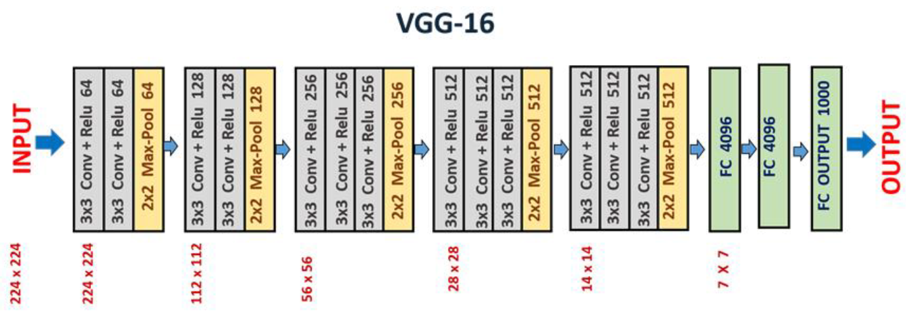

# OpenCV3.4.7  VS2017

## Installing OpenCV 3.4.7  with Visual Studio 2017

C:  opencv-3.4.7 폴더를 새롭게 만든 후에 opencv 설치 파일 압축풀기

#### **윈도우 환경설정**

**윈도우- 내컴퓨터 - 속성 - 고급 시스템 설정 – 고급 탭**의 환경변수 클릭

‘시스템 변수’ 항목에 있는 변수 명 중 ‘Path’를 찾아 더블클릭

‘새로 만들기’ 클릭 – 아래 경로입력 – 확인: C:\opencv-3.4.7\build\x64\vc15\bin

Path 설정 완료되면 컴퓨터 재부팅

#### OpenCV  Visual Studio 프로젝트 설정 및 속성시트\(Property sheet\)만들기

Visual Studio 201x 실행 후 '**파일&gt; 새로 만들기&gt; 프로젝트 선택**

**Visual C++ &gt; 빈 프로젝트** 선택후 ‘_openCV\_temp’_라는 이름으로 생성 OpenCVprop

**메뉴&gt;보기&gt;다른 창&gt;속성 관리자** 선택

**Debug x64 Property Sheet 만들기**

**속성 관리자 창 &gt; 프로젝트명** &gt; **Debugx64**: RightClick.

**새 프로젝트 속성 시트 추가 &gt; 속성시트명**: ‘opencv-3.4.7\_debug\_x64.props’으로 지정 후 추가

> 반드시 .props까지 기재할 것

**공용 속성 &gt; C/C++ &gt; 일반 &gt; 추가 포함 디렉터리 &gt; 편집** click

**추가 포함 디렉터리**&gt; 경로추가

* C:\opencv-3.4.7\build\include 
* C:\opencv-3.4.7\build\include\opencv
* C:\opencv-3.4.7\build\include\opencv2

**공용 속성 &gt; 링커 &gt; 일반 &gt; 추가 라이브러리 디렉터리 &gt; 편집** Click

**링커 추가 라이브러리 디렉터&gt; 경**로 추가

* C:\opencv-3.4.7\build\x64\vc15\lib

**공용 속성&gt; 링커 &gt; 입력 &gt; 추가 종속성&gt; 편집** Click

**링커 추가 종속성**&gt; 경로추가

* opencv\_world347d.lib

**Release x64 Property Sheet 만들기**

**속성 관리자 창 &gt; 프로젝트명** &gt; **Release** **x64**: RightClick.

**새 프로젝트 속성 시트 추가 &gt; 속성시트명**: ‘opencv-3.4.7\_release\_x64.props’으로 지정 후 추가

**공용 속성 &gt; C/C++ &gt; 일반 &gt; 추가 포함 디렉터리 &gt;** 경로추가

* C:\opencv-3.4.7\build\include 
* C:\opencv-3.4.7\build\include\opencv
* C:\opencv-3.4.7\build\include\opencv2

**공용 속성 &gt; 링커 &gt; 일반 &gt; 추가 라이브러리 디렉터리 &gt; 경**로 추가

* C:\opencv-3.4.7\build\x64\vc15\lib

**공용 속성&gt; 링커 &gt; 입력 &gt; 추가 종속성&gt;** 경로추가

* opencv\_world347.lib

> release에서는 'xxx347.lib' , debug 에서는 'xxx347d.lib'

