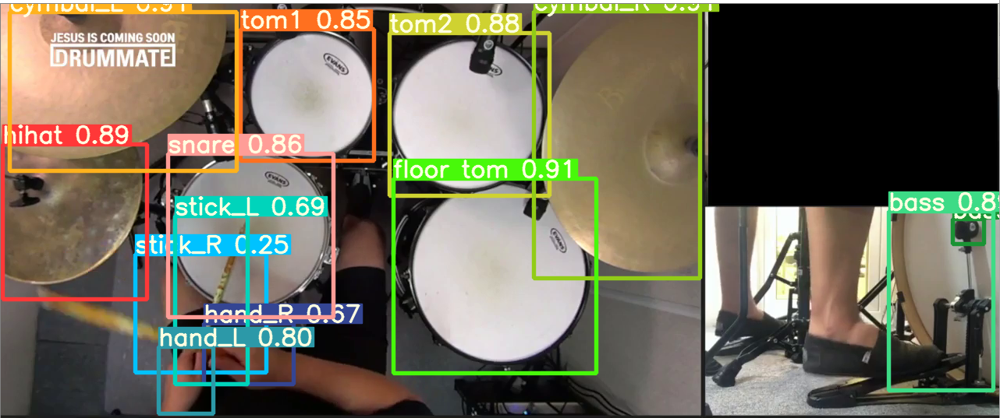

# Drum Playing Detection

21300399 송형석

## Introduction

As computer vision technology develops, it is affecting many parts of industrial areas and our daily life. In addition, by applying deep learning, numerous possibilities for utilizing such computer vision were presented. In this document, we will learn how to detect playing of drums using Python-based YOLO v5.

.png>)

Figure1. Results detecting of drum components, LR hands, LR sticks

This tutorial will proceed in the following order.

1. Data gathering and preparation
2. Model training
3. Detecting
4. System evaluation
5. Conclusion

First of all, you have to installation of YOLOv5. From [https://github.com/ultralytics/yolov5](https://github.com/ultralytics/yolov5) this link, you can get the latest version of YOLOv5. Also as IDE, VS code need to be installed, through this link you can download the VS code. [https://code.visualstudio.com/](https://code.visualstudio.com)

**Data gathering and preparation.**

Before you get started training and detecting, you have to label each image. Download the dark label program from this link. [https://darkpgmr.tistory.com/16](https://darkpgmr.tistory.com/16)

.png>)

1. Image folder directory
2. Labelling method to darknet yolo
3. Label folder directory
4. Labeling class of COCO dataset. This is the important part of data gathering and preparation. There are 80 classes of COCO dataset, but we will manipulate the classes arbitrarily and label them so that each can detect the drum components and both hands. Number 0 - 13 COCO dataset classes : \[‘person’, ‘bicycle’, ‘car’, ‘motorcycle’, ‘airplane’, ‘bus’, ‘train’, ‘truck’, ‘boat’, ‘traffic light’, ‘fire hydrant’, ‘stop sign’, ‘parking meter’] -> 13 COCO based custom dataset classes : \[‘hihat’, ‘snare’, ‘tom1’, ‘cymbal\_L’, ‘tom2’, ‘floor\_tom’, ‘cymbal\_R’, ‘bass’, ‘bass pedal’, ‘left stick’, ‘left hand’, ‘right stick’, ‘right hand’]
5. Set ‘Box + label’

After setting the parameter, you can label the image like Figure3.

!\[텍스트이(가) 표시된 사진

자동 생성된 설명]\(../../.gitbook/assets/2.png)

Figure3. Example of labeled image

The larger the dataset, the better, but there is a risk of overfitting, so 500\~1000 images are appropriate. The recommended images are the drumming image of the top view and the bass part. After finishing labeling, you can get two folder of images and labels. Put it in one folder and set directory as YOLOv5 installed folder and change folder name as images / labels.

**Model training.**

After data gathering and preparation, you will have 500\~1000 images labeled with yolov5. Now you’re ready for training. Through the anaconda prompt, you can set up a virtual development environment and run yolov5 in that environment. First, set the directory to YOLOv5 folder, and then activate the virtual environment. Command is ‘conda activate name’ and in my case, name is yolov5. Finally ‘code .’ this command will load directory .py files to VS code.

!\[텍스트이(가) 표시된 사진

자동 생성된 설명]\(../../.gitbook/assets/3.png)

Figure4. Anaconda prompt console

!\[텍스트, 점수판, 스크린샷이(가) 표시된 사진

자동 생성된 설명]\(../../.gitbook/assets/4.png)

You can now manage and view project’s codes, files, and folders through VS code. After entering the path as shown in Figure 5, open the coco.yaml file. The yaml file containing important information in training that informs classes and the path of images, labels. As mentioned earlier, since labeling is based on the COCO dataset, training on the custom dataset is possible by editing this yaml file.

Figure5. Directory of yaml file

If you see Figure 6, it is the state that appears when you open the initial coco.yaml file. Based on this, modify and save as shown in Figure 7. Convert the class to 13, set the labeled image and label directory, and save it again.

!\[텍스트이(가) 표시된 사진

자동 생성된 설명]\(../../.gitbook/assets/5.png)

Figure6. coco.yaml file

!\[텍스트이(가) 표시된 사진

자동 생성된 설명]\(<../../.gitbook/assets/6 (1).png>)

Figure7. Modified coco.yaml file

At this stage, you are now ready to start training. As you can see in Figure 8 through VS code, you just need to set the parameters for training. Here, issues arise depending on CPU, GPU, and computing power, respectively, and configuration parameters need to be modified. Let’s see command more detail. First, through –data, you need to set directory for coco.yaml which we modified before. Next, you need to set the model of YOLOv5 as --cfg, and you can choose between 4 types: s, m, l, and x. From s to x, there is a trade-off relationship that increases in weight but increases in performance, which is also related to the aforementioned computing power. If your computer's performance is sufficient, YOLOv5l model is enough. Also batch size is related to this issues. If there is insufficient for GPU and CPU, an error of 'out of memory' will occur, and you will need to find the batch size for training by reducing the batch size by /2. An epoch iteration is appropriate of 40-50, too little will cause under-training issues, and too many will cause over-training issues.

.png>)

When training is performed by selecting an appropriate model and batch size, the status shown in figure9 can be viewed through the console window. Through this, you can know the training time and progress.

.png>)

Figure9. Training

After finishing training, from directory \runs\train\’ Name set via --name’\weights, you can get weights with the extension .pt file.

### **Detecting**

In this step, by using the weight file trained in the previous step, you can detect the drum playing from the video. However, due to the limitations of the algorithm for detecting drumming, only the drum image with the top view and the bass separately is valid. When the video is ready, detection can be performed through the command in Figure 10 below.

.png>)

Figure10. Detecting command

\--source to video name, --weights to weight name which we trained previous step. Without a separate algorithm, the result shown in figure 11 can be obtained by detection alone. Depending on the dataset image and training model used, the results may be slightly different, but it will detect drum components well except in special cases.

Figure11. Detecting without algorithm

.png>)

Figure12. Detecting without algorithm

If detection is performed using the attached detect.py file, the result shown in Figure 12 can be obtained. For each drum component, an algorithm to set the hit point, the range at which the stick directly strikes the drum component, and an algorithm to estimate the drumstick have been added.

!\[텍스트이(가) 표시된 사진

자동 생성된 설명]\(<../../.gitbook/assets/12 (2).png>).png>).png>)

Figure13. Hit check

Additionally, an algorithm has been added to ensure that the stick hits the drum component accurately. As can be seen from Figure 13, the end of the drum stick is estimated through image processing, and when that part enters the hit point area, it is recognized as hitting the drum. In the case of the bass, if the bass pedal entered the hit point of the base, it was estimated that the bass was hit.

## **System Evaluation**

In this part, evaluation is done to training and detection performance in various models. In the case of training, evaluation was conducted based on the video used to determine whether the drum component was accurately captured for each frame. In the case of detection, accuracy, recall, and precision will be verified to verify that the drum is struck accurately when the drum is struck, and the latency was also evaluated by calculating the interval between when the drum was struck accurately and the drum struck was estimated through detection. When frames were extracted from the 46-second video used for detecting, 2761 frames were obtained. 60 images per second, that is, each image has an interval of about 0.0167s. This allows to calculate the latency. As shown in Fig. 14, the detection evaluation was done within 4 bars. The latency calculation was done only for the true positive case.

!\[텍스트, 안테나이(가) 표시된 사진

자동 생성된 설명]\(<../../.gitbook/assets/15 (2).png>)

Figure14. Evaluation bar

Result is shown through Table1. True Positive = Estimated drum hits and when the bar score matches / True Negative = Estimated drum hits and not playing for each bar score matches / False Positive = The drum is estimated to have been struck, but not actually played / False Negative = The drum is estimated to have been not struck, but actually played.

**Table1. Evaluation table**

| Model   | Training evaluation | Accuracy | Precision | Recall | Latency   |
| ------- | ------------------- | -------- | --------- | ------ | --------- |
| YOLOv5s | 97.2%               | 89.71%   | 93.75%    | 91.83% | 0.091\[s] |
| YOLOv5l | 99.5%               | 92.65%   | 95.92%    | 94.00% | 0.063\[s] |

.png>)

Overall, it was confirmed that YOLOv5s showed weakness in accuracy and detection strength compared to YOLOv5l model. However, in terms of training time, YOLOv5s has a strength, and when it is applied in real time, the yolov5s model was able to confirm its strength in terms of fps compared to the yolov5l model.

## **Conclusion**

This tutorial will allow you to successfully perform drum counting. However, it does not stop there, It is a project with a lot of possible for further development in various areas by further supplementing the algorithm or applying various image processing and deep learning techniques. Various applications such as improving the accuracy of drum play by fusion with pose estimation techniques, or extracting data in midi format and connecting directly to a virtual instrument are also possible.
