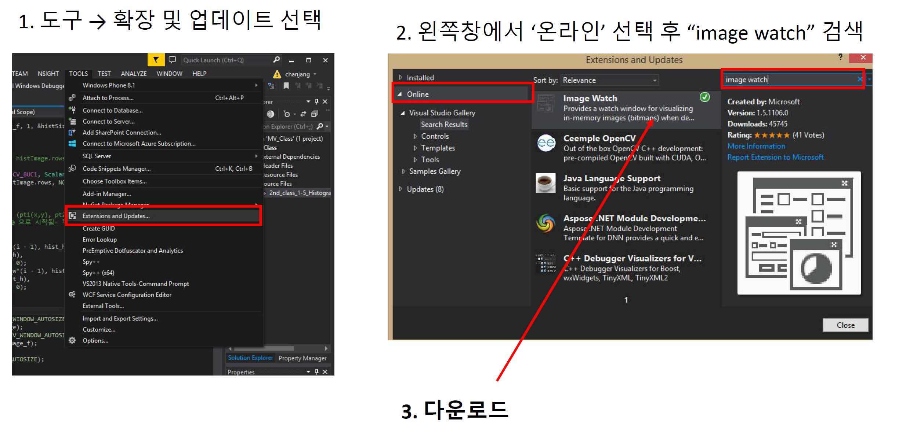

# Tutorial: Create OpenCV Project

## Prepare Project Workspace

Create the lecture workspace as **C:\Users\yourID\source\repos\DLIP**

* e.g. `C:\Users\ykkim\source\repos\DLIP`

Then, create sub-directories as :

* `C:\Users\yourID\source\repos\DLIP\Tutorial`
* `C:\Users\yourID\source\repos\DLIP\Include`


## Save Property Sheet

Copy or move the OpenCV setup property sheets you have created in the **Include** folder.

* `C:\Users\yourID\source\repos\DLIP\Include`

**Property Sheets**

* opencv-4.9.0\_debug\_x64.props
* opencv-4.9.0\_release\_x64.props&#x20;

If you don't have property sheets, then  follow the instruction:


[opencv-install](../../installation-guide/opencv/opencv-install/)



## Create  a New Project in VS

Create a new C++ project in Visual Studio Community

* 새 프로젝트 만들기 > 빈 프로젝트(C++)

Project Name and Location

* Project Name: `DLIP_OpenCV_Simple_Demo`
* Project Folder: `~\DLIP\Tutorial\`

<figure><figcaption></figcaption></figure>

## Setup of Project Property &#x20;

Include the already created OpenCV property sheets

**(Debug x64)**

* **VS 메뉴바**:  `보기>다른 창>속성 관리자`  선택
* **속성 관리자 탭**:  `프로젝트명 > Debugx64`  RightClick.
* `기존 속성 시트 추가` 선택 후 저장된 " **opencv-4.9.0\_debug\_x64.props "**  추가
  * It should be located in "`~\DLIP\Include\"`

<figure><figcaption></figcaption></figure>

**(Release x64)**

* **속성 관리자 탭**:  `프로젝트명 > Releasex64`  RightClick.
* `기존 속성 시트 추가` 선택 후 저장된 " **opencv-4.9.0\_release\_x64.props "**  추가


### Create Demo  Program

Create a new C+ source file

* File Name: `DLIP_OpenCV_Simple_Demo.cpp`
* 솔루션탐색기 탭:  \[프로젝트] > 소스 파일 > 추가 > 새항목 > C++파일(cpp) 선택&#x20;

<figure><figcaption></figcaption></figure>

<figure><figcaption></figcaption></figure>

구성 관리자를 **Debug x64**로 설정&#x20;

<figure><figcaption></figcaption></figure>

Run the following demo program. You can run the program by pressing  (CTRL+F5)


**Demo 1**: Image File Read

* 이미지 파일 다운로드: [Click here](https://github.com/ykkimhgu/DLIP-src/blob/main/tutorial-install/testImage.JPG)

> 이미지 파일과 소스코드가 동일 폴더에 있어야 함!!

```cpp
#include <opencv.hpp>
#include <iostream>

using namespace cv;
using namespace std;

//* @function main
int main()
{
Mat src;

src = imread("testImage.jpg", 1);/// Load an image

if (src.empty())/// Load image check
{
cout << "File Read Failed : src is empty" << endl;
waitKey(0);
}

/// Create a window to display results
namedWindow("DemoWIndow", WINDOW_AUTOSIZE); //WINDOW_AUTOSIZE(1) :Fixed Window, 0: Unfixed window

if (!src.empty())imshow("DemoWIndow", src); // Show image

waitKey(0);//Pause the program
return 0;
}
```

Expected Output

.png>)

***

**Demo  2:**  Video Cam capture

```cpp
#include "opencv.hpp"
#include <iostream>

using namespace cv;
using namespace std;

int main(int argc, char* argv[])
{
    VideoCapture cap(0); // open the video camera no. 0

    if (!cap.isOpened())  // if not success, exit program
    {
        cout << "Cannot open the video cam" << endl;
        return -1;
    }
   namedWindow("MyVideo",WINDOW_AUTOSIZE); //create a window called "MyVideo"

    while (1)
    {
        Mat frame;
        bool bSuccess = cap.read(frame); // read a new frame from video
         if (!bSuccess) //if not success, break loop
        {
             cout << "Cannot read a frame from video stream" << endl;
             break;
        }
        imshow("MyVideo", frame); //show the frame in "MyVideo" window

        if (waitKey(30) == 27) //wait for 'esc' key press for 30ms. If 'esc' key is pressed, break loop
       {
            cout << "esc key is pressed by user" << endl;
            break; 
       }
    }
    return 0;
}
```

Expected Output

<figure><figcaption></figcaption></figure>
