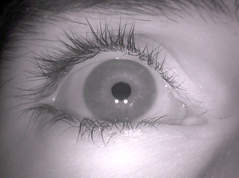

# Tutorial: OpenCv (Python) Basics

## Pre-requisite: Basics of Python & Numpy&#x20;

Skip this if you already know about Python programming


### Python Basics



### Numpy  Basics




***

## Environment Configuration

You must have followed the installation gude for VS code&#x20;



This tutorial code is based on Google Colab Notebook.

You can use two options&#x20;

1. (Recommended) Download the notebook file (\*.ipyn) and run in VS.Code
2. Run directly on Google Colab


### Source code and images&#x20;

Download the tutorial source code and image files.

* [Exercise notebook code](https://github.com/ykkimhgu/DLIP-src/blob/main/Tutorial\_PythonOpenCV/Tutorial\_Opencv\_Python\_Exercise\_2022.ipynb)
* [Test Image Files](https://github.com/ykkimhgu/DLIP-src/upload/main/images)

***

## Tutorial: Basics of Python OpenCV

### Import OpenCV Library

```python
import numpy as np
import cv2 as cv
from matplotlib import pyplot as plt
```

***

### Upload Image Files in Colab

**Option 1: Upload Image Files in Colab**

Read how to load image file in Colab

https://ykkim.gitbook.io/dlip/dlip-installation-guide/ide/colab#loading-image-file-in-colab

**Option 2: Upload image file from local drive**

```
from google.colab import files
uploaded=files.upload()
```

### Load & Show Image File

#### Option 1 (recommend): Using matplot `plt.imshow()`

This method is recommended for showing images. This tutorial will use matplotlib functions.

> matplotlib에서 rgb 채널 순서가 다르다

* matplot: R-B-G
* OpenCV: G-B-R

```python
# Load image
img = cv.imread('handonglogo.jpg')


# Show Image using matplotlib
# matplotlib에서 rgb 채널 순서가 다름
# matplot:  R-B-G
# OpenCV:   B-G-R
imgPlt = cv.cvtColor(img, cv.COLOR_BGR2RGB)

plt.imshow(imgPlt),plt.title('Original')
plt.xticks([]), plt.yticks([])
plt.show()
```

#### Option 2 (for .py only): Using OpenCV imshow()

Python files running on local drive supports OpenCV `cv.imshow()`

BUT, Notebook files such as Colab and Jupyter does NOT support OpenCV `cv.imshow()`

```python
# Load image
img = cv.imread('handonglogo.jpg')

# Show Image using colab imshow
cv.imshow('source',img) 
```

#### Option 3 (colab)

CoLAB provides a similar function called `cv2_imshow()`.\
But this is NOT recommended method. Import

`from google.colab.patches import cv2_imshow as cv_imshow`

```python
# Import COLAB imshow() 
from google.colab.patches import cv2_imshow as cv_imshow

# Load image
img = cv.imread('handonglogo.jpg')

# Show Image using colab imshow
cv_imshow(img) 
```

### Open WebCam ( \*py only)

[Download example src in python](https://github.com/ykkimhgu/DLIP-src/blob/main/Tutorial\_PythonOpenCV/Tutorial\_opencv\_python\_WebCam\_vscode\_2022.py)

> cv.VideoCapture(0) is NOT available in Colab.

```python
# Webcam is used for *.py code. 
# Using webcam in notebook(colab, jupyter) requires more complex setup.

cap = cv.VideoCapture(0)

while(1):
    _, frame = cap.read()

    cv.imshow('frame',frame)
    
    k = cv.waitKey(5) & 0xFF
    if k == 27:
        break

cv.destroyAllWindows()
cap.release()
```

***

### Spatial Filter

* Box filter
* Gaussian filter
* Median filter

```python
# Load image
img = cv.imread('Pattern_original.tif')

# Spatial Filter
blur = cv.blur(img,(5,5))
gblur = cv.GaussianBlur(img,(5,5),0)
median = cv.medianBlur(img,5)

# Plot results
plt.subplot(221),plt.imshow(img),plt.title('Original')
plt.xticks([]), plt.yticks([])
plt.subplot(222),plt.imshow(blur),plt.title('Blurred')
plt.xticks([]), plt.yticks([])
plt.subplot(223),plt.imshow(gblur),plt.title('Gaussian Blurred')
plt.xticks([]), plt.yticks([])
plt.subplot(224),plt.imshow(median),plt.title('Median')
plt.xticks([]), plt.yticks([])
plt.show()
```


***

### Thresholding

[thresh()](https://docs.opencv.org/3.4.17/d7/d1b/group\_\_imgproc\_\_misc.html#gae8a4a146d1ca78c626a53577199e9c57)

`Python:cv.threshold(src, thresh, maxval, type[, dst]) ->retval, dst`

#### Manual Local Threshold

```python
# Open Image
img = cv.imread('coins.png',0)

thVal=127

# Apply Thresholding
ret,thresh1 = cv.threshold(img,thVal,255,cv.THRESH_BINARY)
ret,thresh2 = cv.threshold(img,thVal,255,cv.THRESH_BINARY_INV)

# Plot results
titles = ['Original Image','BINARY','BINARY_INV']
images = [img, thresh1, thresh2]

for i in range(3):
    plt.subplot(1,3,i+1),plt.imshow(images[i],'gray',vmin=0,vmax=255)
    plt.title(titles[i])
    plt.xticks([]),plt.yticks([])
plt.show()
```


#### Adaptive Threshold

`cv.adaptiveThreshold( src, maxValue, adaptiveMethod, thresholdType, blockSize, C[, dst] )`

Example code

```python
# Read image
img = cv.imread('sudoku.jpg',0)

# Preprocessing
img = cv.medianBlur(img,5)

# Global threshold
ret,th1 = cv.threshold(img,127,255,cv.THRESH_BINARY)

# Local threshold
th2 = cv.adaptiveThreshold(img,255,cv.ADAPTIVE_THRESH_MEAN_C,\
            cv.THRESH_BINARY,11,2)
th3 = cv.adaptiveThreshold(img,255,cv.ADAPTIVE_THRESH_GAUSSIAN_C,\
            cv.THRESH_BINARY,11,2)

# Plot results
titles = ['Original Image', 'Global Thresholding (v = 127)',
            'Adaptive Mean Thresholding', 'Adaptive Gaussian Thresholding']
images = [img, th1, th2, th3]

for i in range(4):
    plt.subplot(2,2,i+1),plt.imshow(images[i],'gray')
    plt.title(titles[i])
    plt.xticks([]),plt.yticks([])
plt.show()
```


#### Plot Histogram

```python
hist=cv.calcHist(images, channels, mask, histSize, ranges[, hist[, accumulate]]	)
```

Example Code

```python
# Open Image
img = cv.imread('coins.png',0)

histSize = 256
histRange = (0, 256) # the upper boundary is exclusive
b_hist = cv.calcHist(img, [0], None, [histSize], histRange, False)

hist_w = 512
hist_h = 400
bin_w = int(round( hist_w/histSize ))
histImage = np.zeros((hist_h, hist_w, 3), dtype=np.uint8)

# Normalize histogram output
cv.normalize(b_hist, b_hist, alpha=0, beta=hist_h, norm_type=cv.NORM_MINMAX)

for i in range(1, histSize):
    cv.line(histImage, ( bin_w*(i-1), hist_h - int(b_hist[i-1]) ),
            ( bin_w*(i), hist_h - int(b_hist[i]) ),
            ( 255, 0, 0), thickness=2)

# Plot Results
#cv.imshow('Source image', img)
#cv.imshow('calcHist Demo', histImage)

plt.subplot(2,2,1),plt.imshow(img, 'gray')
plt.title('Source image')
plt.xticks([]),plt.yticks([])
plt.subplot(2,2,2),plt.imshow(histImage)
plt.title('CalcHist image')
plt.xticks([]),plt.yticks([])
plt.show()
```

### Morphology

Morphology: Erode, Dilate

```python
# Open Image
src = cv.imread('coins.png',0)


# Threshold
ret,thresh1 = cv.threshold(src,127,255,cv.THRESH_BINARY)
img=thresh1

# Structure Element for Morphology
cv.getStructuringElement(cv.MORPH_RECT,(5,5))
kernel = np.ones((5,5),np.uint8)

# Morphology
erosion = cv.erode(img,kernel,iterations = 1)
dilation = cv.dilate(img,kernel,iterations = 1)
opening = cv.morphologyEx(img, cv.MORPH_OPEN, kernel)
closing = cv.morphologyEx(img, cv.MORPH_CLOSE, kernel)


# Plot results
titles = ['Original ', 'Opening','Closing']
images = [src, opening, closing]

for i in range(3):
    plt.subplot(1,3,i+1),plt.imshow(images[i],'gray')
    plt.title(titles[i])
    plt.xticks([]),plt.yticks([])
plt.show()
```


***

### Color Segmetation (InRange)

[inRange()](https://docs.opencv.org/3.4/d2/de8/group\_\_core\_\_array.html#ga48af0ab51e36436c5d04340e036ce981)

`dst= cv2.inRange(src, lowerb, upperb, dst=None)`

Example code

```python
# Open Image in RGB
img = cv.imread('color_ball.jpg')

# Convert BRG to HSV 
hsv = cv.cvtColor(img, cv.COLOR_BGR2HSV)

# matplotlib: cvt color for display
imgPlt = cv.cvtColor(img, cv.COLOR_BGR2RGB)

# Color InRange()
lower_range = np.array([100,128,0])
upper_range = np.array([215,255,255])
dst_inrange = cv.inRange(hsv, lower_range, upper_range)

# Mask selected range
mask = cv.inRange(hsv, lower_range, upper_range)
dst = cv.bitwise_and(hsv,hsv, mask= mask)

# Plot Results
titles = ['Original ', 'Mask','Inrange']
images = [imgPlt, mask, dst]

for i in range(3):
    plt.subplot(1,3,i+1),plt.imshow(images[i])
    plt.title(titles[i])
    plt.xticks([]),plt.yticks([])
plt.show()
```


***

### Edge & Line & Circle Detection

#### Edge Detection

Example code 1

```python
# Load image
img = cv.imread('coins.png',cv.COLOR_BGR2GRAY)

# Apply Canndy Edge
edges = cv.Canny(img,50,200)

# Plot Results
#cv.imshow('Edges',edges)
titles = ['Original','Edges']
images = [img, edges]
for i in range(2):
    plt.subplot(1,2,i+1),plt.imshow(images[i],'gray')
    plt.title(titles[i])
    plt.xticks([]),plt.yticks([])
plt.show()
```

Example code 2

```python
# Load image
img = cv.imread('coins.png',cv.COLOR_BGR2GRAY)
# Apply Thresholding then Canndy Edge
thVal=127
ret,thresh1 = cv.threshold(img,thVal,255,cv.THRESH_BINARY)
edges = cv.Canny(thresh1,50,200)

# Plot Results
#cv.imshow('Edges',edges)
titles = ['Original','Edges']
images = [img, edges]
for i in range(2):
    plt.subplot(1,2,i+1),plt.imshow(images[i],'gray')
    plt.title(titles[i])
    plt.xticks([]),plt.yticks([])
plt.show()
    
```


#### Circle Detection

Example code

```python
# Read Image
src = cv.imread('coins.png')

# Convert it to grayscale:
gray = cv.cvtColor(src, cv.COLOR_BGR2GRAY)


# Reduce noise and avoid false circle detection
gray = cv.medianBlur(gray, 5)


# Hough Circle Transform
rows = gray.shape[0]
circles = cv.HoughCircles(gray, cv.HOUGH_GRADIENT, 1, rows / 8,
                               param1=100, param2=30,
                               minRadius=1, maxRadius=30)

# Draw circle
if circles is not None:
    circles = np.uint16(np.around(circles))
    for i in circles[0, :]:
        center = (i[0], i[1])
        # Draw circle center
        cv.circle(src, center, 1, (0, 100, 100), 3)
        # Draw circle outline
        radius = i[2]
        cv.circle(src, center, radius, (255, 0, 0), 3)


# Plot images
titles = ['Original with Circle Detected']
srcPlt=cv.cvtColor(src,cv.COLOR_BGR2RGB)
plt.imshow(srcPlt)
plt.title(titles)
plt.xticks([]),plt.yticks([])
plt.show()
```


#### Line Detection

```python
# Load image
img = cv.imread('sudoku.jpg',0)  # Gray scale image

# Canny Edge Detection
dst = cv.Canny(img, 50, 200, None, 3)

# Copy edges to the images that will display the results in BGR
cdst = cv.cvtColor(dst, cv.COLOR_GRAY2BGR)
cdstP = np.copy(cdst)

# (Option 1) HoughLines
lines = cv.HoughLines(dst, 1, np.pi / 180, 150, None, 0, 0)
if lines is not None:
    for i in range(0, len(lines)):
        rho = lines[i][0][0]
        theta = lines[i][0][1]
        a = np.cos(theta)
        b = np.sin(theta)
        x0 = a * rho
        y0 = b * rho
        pt1 = (int(x0 + 1000*(-b)), int(y0 + 1000*(a)))
        pt2 = (int(x0 - 1000*(-b)), int(y0 - 1000*(a)))
        cv.line(cdst, pt1, pt2, (0,0,255), 3, cv.LINE_AA)

# (Option 2) HoughLinesP
linesP = cv.HoughLinesP(dst, 1, np.pi / 180, 50, None, 50, 10)
if linesP is not None:
  for i in range(0, len(linesP)):
    l = linesP[i][0]
    cv.line(cdstP, (l[0], l[1]), (l[2], l[3]), (0,0,255), 3, cv.LINE_AA)


# Plot Results
#cv.imshow("Source", img)
#cv.imshow("Detected Lines (in red) - Standard Hough Line Transform", cdst)
#cv.imshow("Detected Lines (in red) - Probabilistic Line Transform", cdstP)
titles = ['Source','Standard H.T','Prob. H.T']
images = [img, cdst, cdstP]
for i in range(3):
    plt.subplot(1,3,i+1),plt.imshow(images[i],'gray')
    plt.title(titles[i])
    plt.xticks([]),plt.yticks([])
plt.show()
    
```


### Solution Code

Solution codes for this tutorials can be downloaded

* [Source code (\*.ipynb) for COLAB](https://github.com/ykkimhgu/DLIP-src/blob/main/Tutorial\_PythonOpenCV/Tutorial\_Opencv\_Python\_2022.ipynb)
* [Source code (\*.ipynb) for VSCode](https://github.com/ykkimhgu/DLIP-src/blob/main/Tutorial\_PythonOpenCV/Tutorial\_Opencv\_Python\_vscode\_2022.ipynb)

***

## Exercise

### Beginner Level Exercise

#### Exercise 1

Apply Blur filters, Thresholding and Morphology methods on given images for object segmentation.

[download test image](https://github.com/ykkimhgu/DLIP-src/blob/main/Tutorial\_Threshold\_Morp/testImage.zip)


#### Example 2

Choose the appropriate InRange conditions to segment only ' Blue colored ball'. Draw the contour and a box over the target object. Repeat for Red, and Yellow balls

[download test image](https://github.com/ykkimhgu/DLIP-src/blob/main/images/color\_ball.jpg)


#### Example 3

Detect Pupil/Iris and draw circles.



### Intermediate Level Exercise

#### Exercise: Count number of coins and calculate the total amount

After applying thresholding and morphology, we can identify and extract the target objects from the background by finding the contours around the connected pixels. This technique is used where you need to monitor the number of objects moving on a conveyor belt in an industry process. Goal: Count the number of the individual coins and calculate the total amount of money.


**Procedure:**

1. Apply a filter to remove image noises
2. Choose the appropriate threshold value.
3. Apply the appropriate morphology method to segment coins
4. Find the contour and draw the segmented objects.
5. Exclude the contours which are too small or too big
6. Count the number of each different coins(10/50/100/500 won)
7. Calculate the total amount of money.
