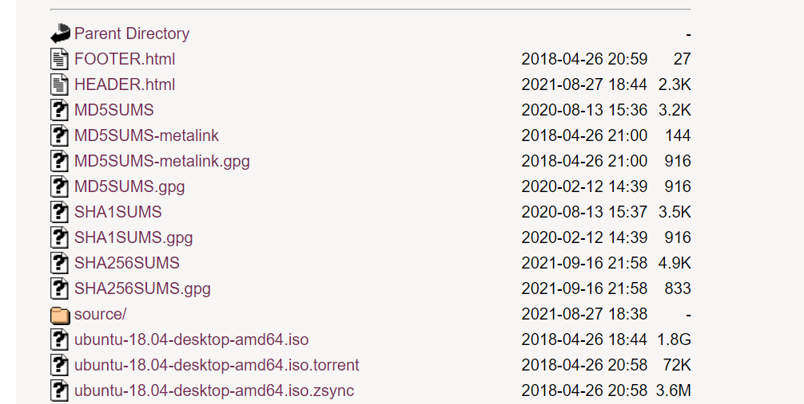
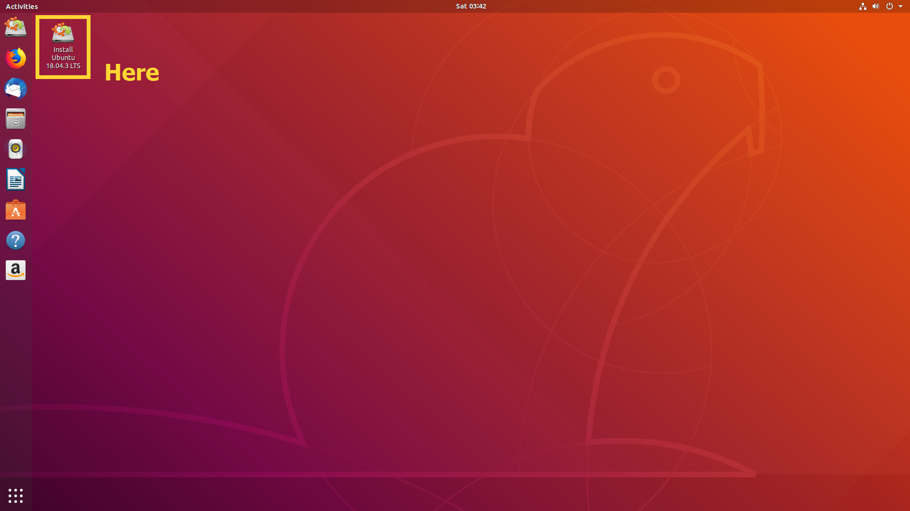

# Ubuntu 18.04 Installation

## Ubuntu 18.04 Installation

### Ubuntu 18.04 - Win10 Dual Booting 설치방법

> Win10 설치된 PC에서 하드 파티션으로 Ubuntu 18.04를 Dual Booting으로 설치하는 방법

**참고자료**

1. [우분투 18.04 설치하기 블로그](https://neoprogrammer.tistory.com/6)
2. 1번 방법 실패시, 설치방법 2 참고: [https://sol2gram.tistory.com/68](https://sol2gram.tistory.com/68), [https://biancco.tistory.com/m/2](https://biancco.tistory.com/m/2)

> 설치 시 PC에 검은 화면만 보여지는 현상이 나타나면 설치방법 2 로 다시 시도

***

## Win 10에서 준비단계

### 우분투 iso 파일 다운로드

Ubuntu-18.04.xx-desktop-amd64.iso 파일 다운로드

> iso는 desktop버전과 server버전의 차이는 GUI (graphic user interface) 차이이다. Desktop 버전이 사용하기에 좀 더 직관적이고, 필요에 따라 cmd방식의 terminal을 사용가능하기에 desktop을 더 선호

### 설치 USB를 Rufus 툴로 세팅

**Rufus 프로그램 다운로드 및 실행**

설치파일: [https://rufus.ie/](https://rufus.ie/)

Rufus 설치 후 실행하면 아래와 같은 툴이 실행

**Rafus 환경 세팅**

* 장치: 설치 USB로 만들 USB를 선택
* 부트 선택: 설치할 다운로드된 우분투 iso파일 선택
* 파티션 방식: GPT방식
  * 선택방법은 윈도우를 설치하고, 멀티 운영체제로 리눅스를 설치할 경우 GPT 파티션 방식의 UEFI 시스템 방식으로 설정
  * 자신의 PC가 UEFI 지원 및 GPT 파티션 방식을 선택할 수 있으면 GPT로 선택하는 것이 기타 사항들에 대해서도 편리
*   포맷 옵션: FAT32

    ​

설정 완료 후 **시작**버튼을 누르면 설치 USB를 세팅하며 몇 분 걸릴 수 있음

### Hard Drive Partition

기존 C: 드라이브의 파트션을 축소하여 우분투가 설치될 파티션을 새롭게 만들기 위함

`Win키` + `R` : Diskmemt.msc 입력

디스크관리에서 C: 드라이브 선택 > 불륨 축소

축소할 공간: 새로 확보할 파티션 용량을 입력하면 됨 (우분투 설치 공간 용량)

*   약 32\~64GB 정도 입력 후 `축소` 버튼 클릭

    ​

할당되지 않는 빈 파티션을 확인

## Ubuntu 18.04 LTS 설치

설치 USB 세팅이 완료됐다면, USB를 PC에 장착해주고 PC 재부팅

### BIOS - 부팅설정 세팅

PC Bios에서 부팅 최우선순위를 USB 부팅 디스크를 지정하는 환경설정을 해야 함

PC 재부팅시 바이오스를 실행하는 아래 단축 키를 계속 누르면 됨. 본인 메인보드 환경에 맞는 키를 입력하여 bios 세팅으로 진입한 뒤 부팅 디스크의 우선순위를 변경

* **F2**, **F10**, **F12**, **del**

**Bios 환경 세팅**

* Secure Boot 옵션 `off`, Fast Bias Boot 옵션: `off`로 설정
* 부팅 1순위를 USB로 설정

### Ubuntu 설치

우분투 환경에 먼저 진입한 다음 그 안에서 설치 (Try Ubuntu without Installing) 옵션을 선택

* 우분투 화면이 바로 실행이 되며, `Install Ubuntu 18.04` 아이콘을 클릭해서 설치 진행

**(중요)** 우분투 화면이 보이지 않고 빈 검은 화면만 뜨는 경우: 다른 설치방법으로 실행 [https://biancco.tistory.com/m/2](https://biancco.tistory.com/m/2)

• 좌측의 언어 선택 ‘한국어’ 선택 후 우측의 Ubuntu 설치 클릭

• 이후 설치 과정에서 WIFI 연결 후 진행해야 OS 업데이트가 가능함

• 상기의 Ubuntu 설치 중 업데이트 다운로드 및 아래의 "그래픽과 와이파이 하드웨어, 플래시, MP3등의 추가 소프트웨어 설치" 부분 체크

* **하단의 체크박스를 체크함으로써 NVIDIA 독점드라이버도 자동설치됨**

• 초기의 분할해둔 파티션에 Ubuntu를 설치하기 위해 ‘**기타**’ 체크

• 초기 디스크 수축에서 분할했던 파티션을 찾아 ‘**남은 공간**’ 선택

• 하단에 `+` 클릭 후 분할을 위한 파티션 크기 용량을 입력

• 아래의 사진과 같이 설정

* Partition:  _**Primary**_ or _Logical_ partition. (큰 상관없음)
* Location for the new partition: select _**Beginning of space**_&#x20;
* _**Ext4 journaling File system**_

**(중요)** 마운트 위치: `/` 를 꼭 지정해야 함

* If you not choose ‘/’ then it will give error in installation “ No root systems is defined”
* When you finish, click Ok.

• 설정 완료 후 ‘**OK**’ 클릭 > **이후 지금 설치** 클릭

* 도시 설정을 대한민국 or 서울로 설정 후 계속 클릭

• 사용자 설정 후 계속 클릭 (한글 안됨)

* username / pwd를 cmd 창에서 자주 입력을 해야 하니 간편한 것으로 설정하기를 권장

• 설치를 자동으로 진행

• 설치 완료 후 ubuntu 재시작하기

### Comment

* PC 및 노트북의 그래픽카드 충돌로 Ubuntu설치가 잘 안되는 경우가 자주 발생이 될 수 있음.
* 인터넷에 다양한 해결방법 참고
* Window10 위에 설치하는 가상환경 Ubuntu는 ROS 실행하는데에 한계가 있음
* Win10에서 Ubuntu 및 ROS를 실행하고 싶으면 Docker로 설치하는 방법을 참고하면 됨
