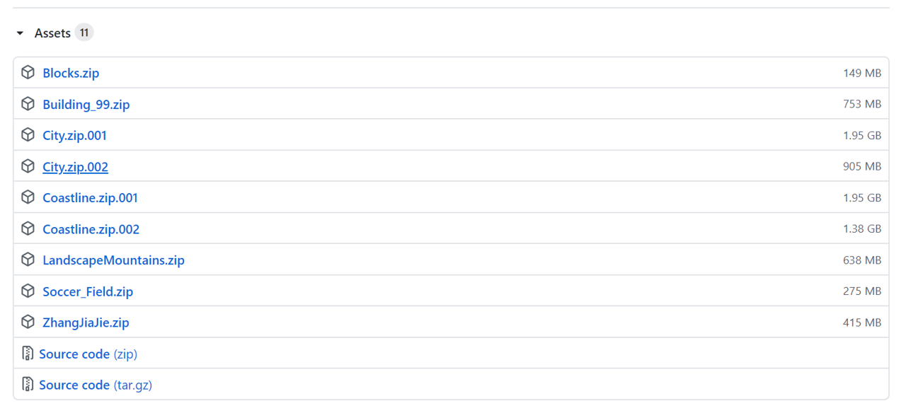
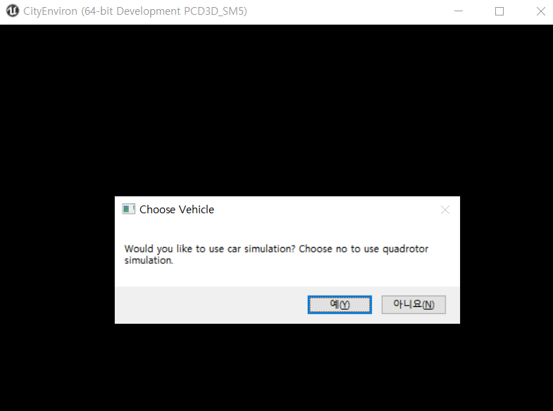

# T\#1

## Download Precompiled AirSim

For this tutorial, we will use precompiled Landscape binary. You can also download the binaries for the environment of your choice from the [latest release](https://github.com/Microsoft/AirSim/releases).

* You should have completed the [set-up proces](../setup/build-on-windows.md)
* Go to AirSim [latest release](https://github.com/Microsoft/AirSim/releases) and download `City.zip.001` and `City.zip.002` 
* Unzip these two files using **7-zip**
* Double click `CityEnviron.exe` to run
  * Choose vehicle and control with keyboards

    

    

## Controlling Vehicles

Most of our users typically use [APIs](https://github.com/ykkimhgu/gitbook_docs/tree/89bf64c3b2679b45893eec7c530581cd7441d2cf/airsim/docs/tutorial/apis.md) to control the vehicles. However if you can also control vehicles manually. You can drive the car using keyboard, gamepad or [steering wheel](https://github.com/ykkimhgu/gitbook_docs/tree/89bf64c3b2679b45893eec7c530581cd7441d2cf/airsim/docs/tutorial/steering_wheel_installation.md). To fly drone manually, you will need either XBox controller or a remote control \(feel free to [contribute](https://github.com/ykkimhgu/gitbook_docs/tree/89bf64c3b2679b45893eec7c530581cd7441d2cf/airsim/docs/tutorial/CONTRIBUTING.md) keyboard support\). Please see [remote control setup](https://github.com/ykkimhgu/gitbook_docs/tree/89bf64c3b2679b45893eec7c530581cd7441d2cf/airsim/docs/tutorial/remote_control.md) for more details. Alternatively you can use [APIs](https://github.com/ykkimhgu/gitbook_docs/tree/89bf64c3b2679b45893eec7c530581cd7441d2cf/airsim/docs/tutorial/apis.md) for programmatic control or use so-called [Computer Vision mode](https://github.com/ykkimhgu/gitbook_docs/tree/89bf64c3b2679b45893eec7c530581cd7441d2cf/airsim/docs/tutorial/image_apis.md) to move around in environment using the keyboard.

## Don't Have Good GPU?

The AirSim binaries, like CityEnviron, requires a beefy GPU to run smoothly. You can run them in low resolution mode by editing the `run.bat` file on Windows like this:

* run `cmd` and go to the CityEviron directory
* Type the following to start with low resolution

  ```text
  start CityEnviron -ResX=640 -ResY=480 -windowed
  ```

UE 4.24 uses Vulkan drivers by default, but they can consume more GPU memory. If you get memory allocation errors, then you can try switching to OpenGL using `-opengl`

